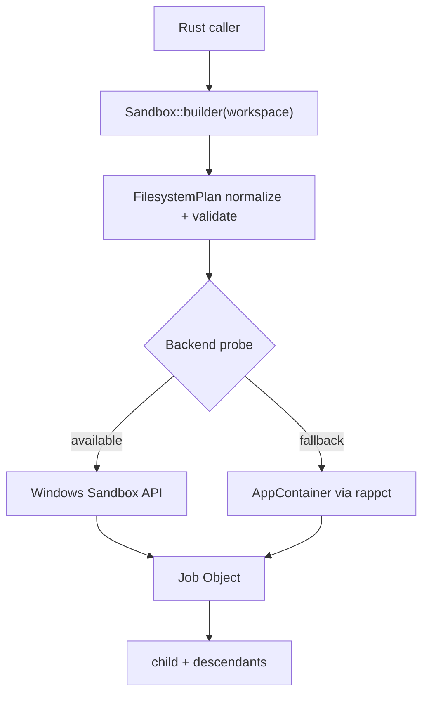
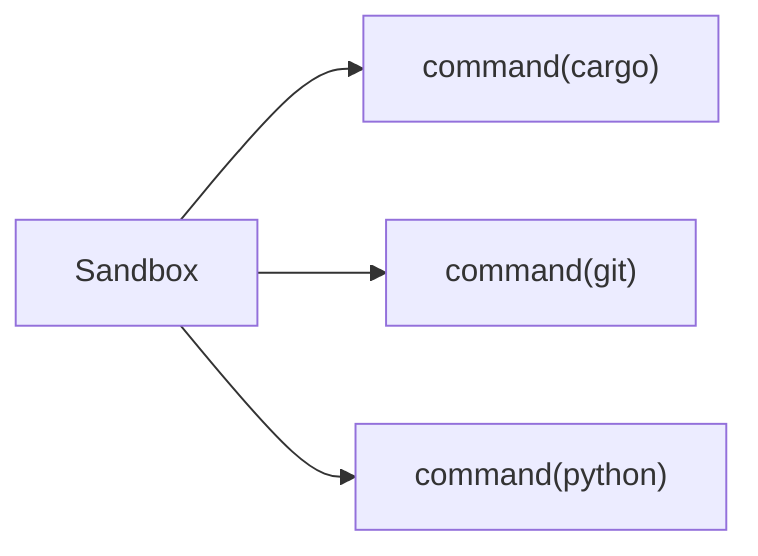
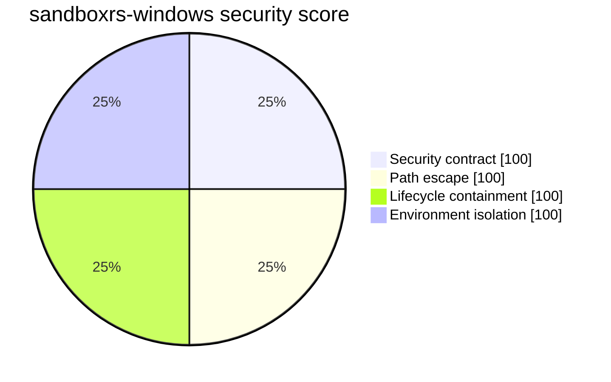

# sandboxrs-windows

**No-admin Windows process sandboxing with a `std::process::Command`-like API.**

`sandboxrs-windows` is a Rust library that launches Windows child processes
inside a validated, reusable authority boundary. It prefers Windows' modern
composable sandbox API when available and falls back to a regular AppContainer
without requiring administrator privileges.


```rust
use sandboxrs_windows::{Sandbox, Stdio};

let sandbox = Sandbox::builder(r"C:\repo")
    .read_only(r"C:\Users\me\.rustup")
    .read_write(r"C:\temp\sandboxrs")
    .build()?;

let output = sandbox
    .command("cargo")
    .arg("test")
    .stdout(Stdio::piped())
    .stderr(Stdio::piped())
    .output()?;
```

## Why sandboxrs?

Modern tooling keeps handing hostile or untrusted workloads a full user token:
AI coding agents, plugin hosts, build scripts, test runners, and package
installers all execute arbitrary commands. `sandboxrs-windows` gives those
systems an explicit filesystem authority boundary without asking for a daemon,
a service, a kernel driver, Docker, WSL, Hyper-V, or administrator rights.

The library is mechanism only. It understands paths, environment, stdio,
timeouts, and resource limits. It does not know about agents, plans, LLMs,
tools, or workflows.

## Architecture



Backend selection is capability probing, never OS-version guessing:

1. Load `processmodel.dll` from System32 and resolve
   `Experimental_CreateProcessInSandbox`.
2. Query `Experimental_QuerySandboxSupport` when present.
3. Perform a real minimal sandbox launch and outside-write denial.
4. If the modern API is unavailable or disabled, probe a real AppContainer
   launch through `rappct`.
5. If neither works, `build()` fails closed. There is no silent
   `std::process::Command` fallback.



One validated `Sandbox` can run many commands without rebuilding policy.

## Public API

The public surface intentionally stays small and familiar:

```rust
use std::time::Duration;
use sandboxrs_windows::{BackendKind, Sandbox, Stdio};

let sandbox = Sandbox::builder(r"C:\repo")
    .read_only(r"C:\Users\me\.rustup")
    .read_write(r"C:\temp\sandboxrs")
    .timeout(Duration::from_secs(120))
    .max_memory(2 * 1024 * 1024 * 1024)
    .max_processes(32)
    .build()?;

let mut child = sandbox
    .command("cargo")
    .args(["test", "--workspace"])
    .env("RUST_BACKTRACE", "1")
    .stdout(Stdio::piped())
    .stderr(Stdio::piped())
    .spawn()?;

let status = child.wait()?;
```

Key types:

- `SandboxBuilder` validates and initializes a sandbox.
- `Sandbox` is a reusable, immutable authority boundary.
- `SandboxCommand` mirrors `std::process::Command`.
- `SandboxChild` owns the process tree and Job Object.
- `SandboxOutput` returns status, stdout, stderr, backend, and duration.
- `BackendKind` reports `windows-sandbox-api` or `appcontainer`.

`std::process::Stdio` is opaque, so the crate exposes its own
`sandboxrs_windows::Stdio::{inherit, null, piped}`.

## Filesystem policy

The workspace passed to `Sandbox::builder` is read-write. Explicit `read_only`
and `read_write` roots are compiled into a private `FilesystemPlan` before any
backend sees them.

```text
C:\repo                  RW
C:\repo\.readonly        RO
C:\secret               HIDDEN (default)
```

Rules are normalized, duplicates are resolved, and overlapping policy uses
"more specific path wins." If a backend cannot faithfully represent a rule, it
returns `UnsupportedPolicy` instead of silently flattening authority.

## Command-line adapter

`sandboxrs.exe` is a thin adapter for Node, Python, Java, Go, shell scripts,
and other runtimes:

```powershell
sandboxrs.exe exec --workspace C:\repo --ro C:\Users\me\.rustup -- cargo test
sandboxrs.exe exec --json --workspace C:\repo -- cargo check
sandboxrs.exe doctor
```

JSON mode keeps child stdout/stderr as child data:

```json
{
  "backend": "appcontainer",
  "exit_code": 0,
  "duration_ms": 1831,
  "stdout": "...",
  "stderr": ""
}
```

## Benchmarks

The deterministic eval suite (`sandboxrs-eval`) runs on clean GitHub-hosted
Windows VMs and proves every result twice: first that the operation succeeds
outside the sandbox, then that the sandbox contains it. Reports are uploaded
as CI artifacts and stored in [`evals/results`](evals/results).

### Measured 2026-08-08 (Evals V2, standard user)

| Suite | Windows Server 2025 (26100) | Windows 11 ARM64 (26200) |
|---|---|---|
| Backend selected | AppContainer | AppContainer |
| Security evidence PASS | 44 / 44 | 44 / 44 |
| Security ESCAPE | 0 | 0 |
| Security ERROR (invalid test) | 0 | 0 |
| Developer compatibility | 1 / 5 | 2 / 5 |
| Privilege | standard user | standard user |

Every security case in Evals V2 records four-state evidence
(`pass` / `escape` / `error` / `unsupported`), requires a native control proving
the attack is possible outside the sandbox, restores fixture state after the
control, and verifies filesystem postconditions. The measured result is
**44 / 44 pass, 0 escapes, 0 invalid tests** on both runners under a real
standard Windows user.

This is an experimental benchmark, not a security certification: the headline
is "zero escapes and zero invalid tests," not "100% secure."



### What is measured

Security contract:

- native control writes outside the sandbox must succeed
- workspace read / write / delete must succeed
- readonly read must succeed; readonly write and delete must fail
- hidden secret read and write must fail
- root, child, and grandchild escape attempts must all fail

Path escape:

- `..` traversal, absolute paths, case variations, `\\?\` extended paths
- junctions, symlinks, and nested junctions

Lifecycle containment:

- explicit kill terminates descendants
- timeout terminates the process tree
- `max_processes` contains a 1000-process bomb
- `max_memory` terminates a 2 GB allocation

Compatibility:

- `node --version` and `cargo --version` pass on both runners
- `git --version` passes on Windows 11 ARM64
- `cmd.exe` and `python` currently need additional runtime grants and fail at
  process initialization on these VMs; this is a compatibility gap, not an
  escape

The workflow is intentionally honest about that distinction: filesystem,
descendant, reparse, path, handle, Job-containment, resource, and environment
suites are required and gate CI, while compatibility failures are reported but
do not turn the workflow red by themselves.

## Evals V2 methodology

Eval results use a four-state outcome model:

```text
Pass        attack precondition valid, attack executed, OS blocked it
Escape      forbidden operation succeeded
Error       test never validly exercised the property
Unsupported backend/platform genuinely cannot run the test
```

A process that fails to launch is `Error`, never `Pass`. Every forbidden
security test has a native control proving the attack is possible outside the
sandbox, and every descendant test first proves the same capability works
inside the workspace before asserting it fails in the secret area.

The eval covers:

- filesystem authority with postcondition verification
- child, grandchild, and great-grandchild authority propagation
- real directory symlinks, file symlinks, NTFS junctions, and nested junctions
- dot-dot, absolute, extended-length, case, and relative path representations
- rename/move and hard-link attacks
- inherited handle exfiltration (read through a pre-opened secret handle)
- Job breakaway, detached, and suspended-resume descendants
- process-count, memory, and timeout boundary tests
- `env_clear()` isolation where the child must still launch with a correctly
  rebuilt environment block (including the real `=C:=<current directory>`
  drive variables for every present logical drive)
- cross-sandbox policy isolation (forced backend on every nested `Sandbox`)
- a real malicious Rust fixture built through `cargo`

GitHub CI runs the AppContainer suite as a temporary standard user and fails
if the eval reports `admin: true`, making the no-admin claim testable.
`--backend windows-sandbox-api` runs the same contract against the modern API
and reports `unsupported` when the host feature is disabled.

Run locally:

```powershell
cargo run --bin sandboxrs-eval -- --backend appcontainer --require-standard-user
cargo run --bin sandboxrs-eval -- --backend windows-sandbox-api --allow-unsupported
```

## Security posture

`sandboxrs-windows` is not a promise that arbitrary hostile binaries are
perfectly contained. It is a no-admin process launcher with constrained
filesystem authority. Reparse points, inherited handles, and experimental API
instability are treated as adversarial in the eval suite.

- Fail closed: no backend means no `Sandbox`.
- No silent downgrade: unrepresentable policy is an error.
- No daemon, service, kernel driver, DLL injection, or machine-wide firewall
  changes.
- `Experimental_CreateProcessInSandbox` is experimental and may change.
  All experimental FFI is isolated behind a private backend module.
- Baseline system roots are granted read/execute best-effort; user policy is
  never flattened silently.

## Development

```powershell
cargo build --all-targets
cargo test --all-targets
cargo run --bin sandboxrs -- doctor --json
cargo run --bin sandboxrs-eval -- --report sandboxrs-eval.json
```

CI:

- `windows.yml` builds and tests on `windows-latest`, then reports the ignored
  backend contract tests on Windows 11 ARM64.
- `security-evals.yml` runs the deterministic benchmark on `windows-2025` and
  `windows-11-arm`, uploading the JSON report as an artifact.

Agentic evals are intentionally separate; see
[`evals/agent-scenarios.md`](evals/agent-scenarios.md) and
[`evals/run-agent-evals.ps1`](evals/run-agent-evals.ps1).

## Status

- M0 real backend probe: passed on AppContainer.
- M1 modern backend + reusable Rust API: implemented; modern API is
  export-present but feature-disabled on the public Windows runners tested.
- M3 AppContainer fallback via `rappct`: implemented and benchmarked.
- M4 process quality: pipes, timeout, kill, memory/process limits, diagnostics.
- M5 EXE: `sandboxrs exec`, `sandboxrs doctor`, `--json`.

See [PLAN.md](PLAN.md) for the full v1 contract and
[FUTUREPLAN.md](FUTUREPLAN.md) for the backlog.
